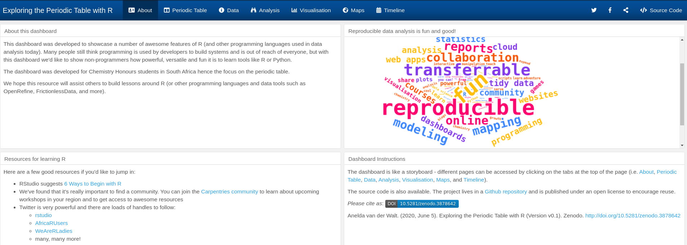
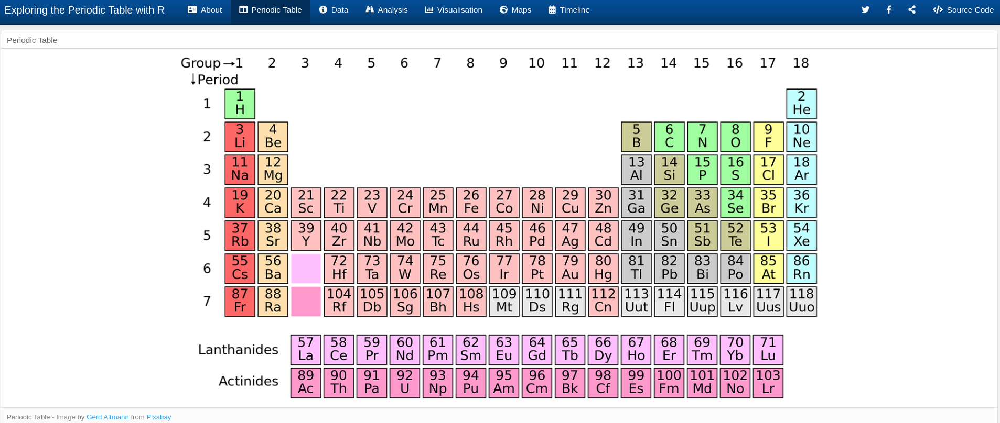
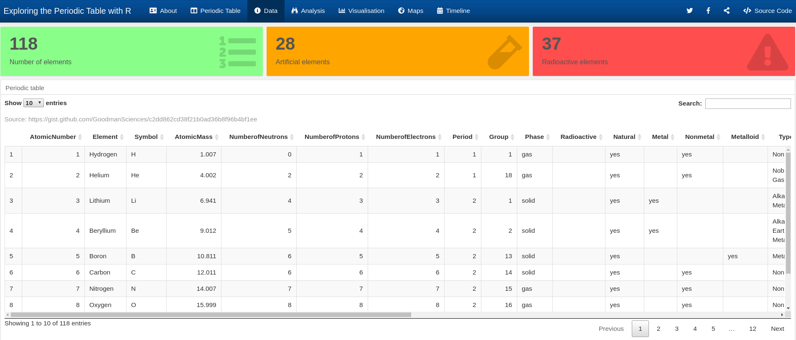
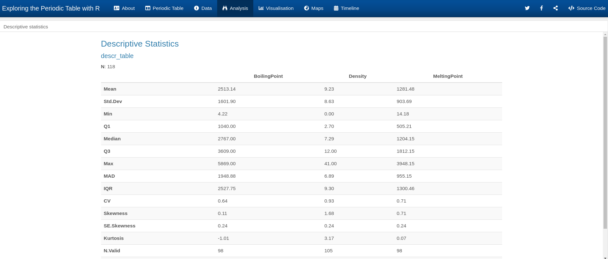
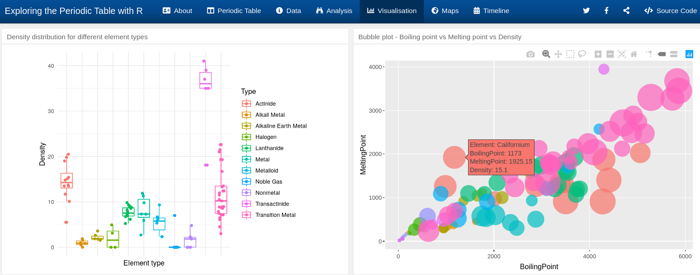
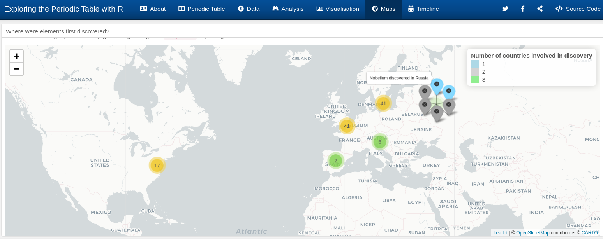
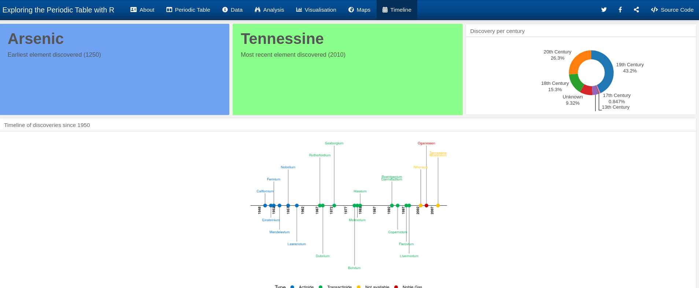

# About

This dashboard was developed to showcase a number of awesome features of R (and by definition, other programming languages used in data analysis today). Many people still think programming is used by developers to build systems and is out of reach of everyone else, but with this dashboard we'd like to show non-programmers how empowering, versatile and fun it can be to learn tools like R or Python.

The dashboard was developed for Chemistry Honours students in South Africa hence the focus on the periodic table. Of course this dashboard is also accessible to learners in high school who have learned about the periodic table.

We hope this resource will inspire and assist others to build more accessible lessons around R (or other programming languages and data tools such as OpenRefine, FrictionlessData, and more).

# Dashboard live

You can view the dashboard at https://rpubs.com/anelda/periodic-table-R

# Cite

Anelda van der Walt. (2020, June 5). Exploring the Periodic Table with R (Version v0.1). Zenodo. http://doi.org/10.5281/zenodo.3878642

# Dashboard components

## Setup

- *Development environment*: [RStudio](https://rstudio.com/)
- *R package*: [flexdashboard](https://rmarkdown.rstudio.com/flexdashboard/)
- *Dashboard format*: I used the flexdashboard *storyboard* mode, but there are many other options for flexdashboard
- *Original idea*: This wonderful tutorial for building an [HR Dashboard](https://towardsdatascience.com/building-an-hr-dashboard-in-r-using-flexdashboard-76d14ed3f32) in flexdashboard was the inspiration for the Periodic Table dashboard. Thanks to [Sagar Abhay Kulkarni](https://github.com/sagarkulkarny) for making this great resource available and sharing the code! 
- *Periodic table data*: The data was obtained from the [Github repository of GoodmanSciences](https://gist.github.com/GoodmanSciences/c2dd862cd38f21b0ad36b8f96b4bf1ee) in Comma Separated Value (CSV) format. From the discussion in the repository I understand that there may be errors in the data. The R script reads data directly from the Github repository and updates to the data can be reflected in the dashboard if the script is run again
- *Country of discovery data*: The data was obtained from [the image](https://www.jamiebgall.co.uk/periodic-table?pgid=jry6l6ed-6997541b-20fd-431a-86ca-b27a46663898) published by [Dr Jamie Gallagher](https://twitter.com/JamieBGall). The data was transcribed manually into CSV format to make it machine readable and combine with the perodic table data. Errors may have slipped in.

One of my favourite collection of packages that is used throughout the creation of the dashboard is `[tidyverse](https://www.tidyverse.org/)`. Specifically `[dplyr](https://dplyr.tidyverse.org/)` that allows one to do amazing data manipulation tricks. There are many resources online to learn more about the individual functions available in `dplyr` including tips about combining the functionality in data pipelines.

## Introduction

The introduction includes a wordcloud.

- *Data*: A dataframe containing a fictional word frequency table created in the script 
- *R package*: Wordcloud2
- *R package link*: https://cran.r-project.org/web/packages/wordcloud2/vignettes/wordcloud.html
- *Useful tutorial*: https://medium.com/analytics-vidhya/visualizing-data-using-wordcloud-in-r-2f9d100946f4 (includes info about creating frequency table in R)
- *Colour palette*: Used https://coolors.co/ to identify fun colours for the wordcloud
- *Icons*: I've used [font awesome icons](https://fontawesome.com/start) which is available through the flexdashboard package in R

## The periodic table

I included an image of the periodic table to help learners consider the wealth of information hidden in the periodic table as we know it.

- *Image*: Image by [Gerd Altmann](https://pixabay.com/users/geralt-9301/?utm_source=link-attribution&utm_medium=referral&utm_campaign=image&utm_content=1059755) from [Pixabay](https://pixabay.com/?utm_source=link-attribution&utm_medium=referral&utm_campaign=image&utm_content=1059755)
- *Free images resource*: I love [Pixabay](https://pixabay.com) and use it for almost all my projects, including presentations, websites, and more

## Data

The data is displayed here to help learners connect the original image of the periodic table, with the tabular format, allowing them to see how colours and position in the periodic table can be converted to machine-readable data in a table. 

The coloured boxes at the top of the page is a feature of flexdashboard - valueboxes. The valueboxes can display any single number or word that you identify from your data. It is possible to customise the size of valueboxes, colour, icon, content, and the number of valueboxes displayed on a page. Here I've used a Base R function `nrows` in combination with `dplyr` `filter` to calculate the number of rows that fit certain criteria and displayed the resultant number in the valuebox.

- *Data*: https://gist.github.com/GoodmanSciences/c2dd862cd38f21b0ad36b8f96b4bf1ee
- *R package*: The table is displayed using the DT R package
- *R package link*: https://rstudio.github.io/DT/#:~:text=The%20R%20package%20DT%20provides,other%20features%20in%20the%20tables.

## Analysis

With this page I wanted to show learners that R also allows one to do actual calculations. My expectation is that most people would have been doing their work in spreadsheet packages up to now and would like to see that R can not only draw pretty pictures, but can also do the things they've been doing in spreadsheet packages.

With three lines of code and the implementation of a wonderful package, it is possible to specify the columns to do the calculations on and get all summary statistics for the specified columns. Here we selected the columns `Boiling Point`, `Density`, and `Melting Point` for our analysis.

- *R package*: summarytools
- *R package link*: https://cran.r-project.org/web/packages/summarytools/vignettes/Introduction.html

There are of course loads of other calculations, modelling, etc that can be done on your data in R. Here I wanted to show something fundamental that many people would have encountered so that it is relatable. If you want to do more advanced analysis or modelling, please ask on Twitter or search the Web for packages that can support your work.

## Visualisation

With this page I wanted to awe learners with the kind of plots that are possible in R. On the left we have a boxplot with scattered points. On the right we have an interactive bubble plot where the user can zoom in and out and hover over specific elements to get more information from the data.

- *R packages*: 

    - Boxplot: ggplot2 geom_boxplot - https://ggplot2.tidyverse.org/reference/geom_boxplot.html
    - Scatterplot overlay: ggplot2 geom_jitter - https://ggplot2.tidyverse.org/reference/geom_jitter.html
    - Tutorial: https://www.r-graph-gallery.com/89-box-and-scatter-plot-with-ggplot2.html
    
    - Interactive bubbleplot:
    
        - ggplot2 & ggplotly: https://www.r-graph-gallery.com/bubble_chart_interactive_ggplotly.html
        
- R graph gallery: If you can dream it, you can do it. R offers a terrific array of options for data visualisation. Visit https://www.r-graph-gallery.com/ for inspiration.

## Maps

One of the things that I've used most often in R, is the mapping functionality. It's so powerful to visualise data with a geospatial component on a map and really helps to tell a story. I am hoping by including a mapping component to the periodic table, learners might see how accessible it is to add data to a map and how data can often include a geospatial component that may not be that obvious initially.

#### Data preparation: 

I used information obtained from [the image](https://www.jamiebgall.co.uk/periodic-table?pgid=jry6l6ed-6997541b-20fd-431a-86ca-b27a46663898) published by [Dr Jamie Gallagher](https://twitter.com/JamieBGall). A CSV file was created that contained the Element number, and columns for each of the countries' that appear in the image.

I added a column with the name of the capital of each of those countries in order to do programmatic geocoding (obtain coordinates) directly from R. Using just the country resulted in incorrect (non-specific) geocoding.

The script for geocoding is available at https://github.com/anelda/showcaseR-periodic-table/blob/master/scripts/geocode_countries.R

- *R package*: tmaptools 
- *function*: geocodeOSM
- *R package link*: https://cran.r-project.org/web/packages/tmaptools/tmaptools.pdf

#### Interactive map

- *R package*: leaflet
- *R pakage link*: https://rstudio.github.io/leaflet/
- *Useful tutorial*: https://www.earthdatascience.org/courses/earth-analytics/get-data-using-apis/leaflet-r/

## Timeline

We once again find the valueboxes mentioned under the [Data](#Data) section above. 

#### Fixing dates

The first thing to do, is to convert the date values into something R will recognize as a date. 

- *R package*: lubridate
- *R package link*: https://lubridate.tidyverse.org/

#### Doughnut chart

Here I used a combination of `dplyr` and `ggplot2` discussed above.

#### Timeline plot

In order to get the timeline to display properly in the smaller space available, I limited the number of items shown to only elements discovered after 1950. That was an arbitrary choice based on what looked pretty. There are other timeline packages in R as well.

I've used this package once or twice in projects to communicate the progress with team members.

- *R package*: ggplot2 (as above) but with loads of customisations using additional settings
- *Tutorial*: https://benalexkeen.com/creating-a-timeline-graphic-using-r-and-ggplot2/

