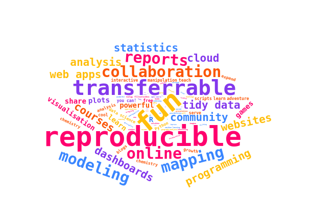

```{r setup, include=FALSE}
library(flexdashboard)
library(ggplot2)
library(readxl)
library(tidyverse)
library(plotly)
library(ggmap)
library(tmaptools)
library(DT)
library(lubridate)
library(leaflet)
library(countrycode)
library(png)
library(htmlwidgets)
library(htmltools)
library(wordcloud2)
library(summarytools)


require(knitr)
```

```{r prepare_data}
# Read data

ptable <- read_csv("https://gist.githubusercontent.com/GoodmanSciences/c2dd862cd38f21b0ad36b8f96b4bf1ee/raw/1d92663004489a5b6926e944c1b3d9ec5c40900e/Periodic%2520Table%2520of%2520Elements.csv")

# Read country_data
# Created from https://www.smithsonianmag.com/smart-news/the-periodic-table-of-elemental-discoveries-1773011/

pcountries <- read_csv("data/pt_countries.csv")

ptable_countries <- ptable %>% 
  left_join(pcountries, by = c("AtomicNumber" = "atomic_number")) %>% 
  pivot_longer(cols = starts_with("country"),
               names_to = "country_list",
               names_prefix = "country",
               values_to = "country", 
               values_drop_na = TRUE) %>% 
  mutate(country_name = countrycode(country, origin = "iso3c", destination = "country.name")) %>% 
  mutate(address = case_when(country == "aut" ~ paste("Vienna, ", country_name),
                          country == "che" ~ paste("Bern, ", country_name),
                          country == "deu" ~ paste("Berlin, ", country_name),
                          country == "dnk" ~ paste("Copenhagen, ", country_name),
                          country == "esp" ~ paste("Madrid, ", country_name),
                          country == "fin" ~ paste("Helsinki, ", country_name),
                          country == "fra" ~ paste("Paris, ", country_name),
                          country == "gbr" ~ paste("London, ", country_name),
                          country == "ita" ~ paste("Rome, ", country_name),
                          country == "rou" ~ paste("Bucharest, ", country_name),
                          country == "rus" ~ paste("Moscow, ", country_name),
                          country == "swe" ~ paste("Stockholm, ", country_name),
                          country == "usa" ~ paste("Washington DC, ", country_name)))
# Geocode data
# Run only once to get geocode, then load from RDA file
# source("scripts/geocode_countries.R")
# geocoding <- geocode_countries(ptable_countries, "address")
# save(geocoding, file = "data/country_geocoding.rda")

load("data/country_geocoding.rda")

ptable_countries <- ptable_countries %>% 
  left_join(geocoding, by = c("address" = "query")) 

# Clean up
remove(geocoding)

```

About {data-icon="fa-address-card"}
=============================

Row {data-height=400}
-----------------------------

### About this dashboard

This dashboard was developed to showcase a number of awesome features of R (and other programming languages used in data analysis today). Many people still think programming is used by developers to build systems and is out of reach of everyone, but with this dashboard we'd like to show non-programmers how powerful, versatile and fun it is to learn tools like R or Python. 

The dashboard was developed for Nanotechnology Honours students in South Africa hence the focus on the periodic table. 

We hope this resource will assist others to build lessons around R (or other programming languages and data tools such as OpenRefine, FrictionlessData, and more).

### Reproducible data analysis is fun and good!

```{r words, fig.align="center"}

count_words <- c(8, 4, 8, 7, 5, 
                 3, 6, 3, 2, 4, 
                 3, 1, 2, 5, 2, 
                 4, 5, 6, 3, 2, 
                 2, 3, 4, 5, 6,
                 1, 2, 6, 4, 5,
                 5, 3, 2, 1, 2,
                 5, 3, 2, 1, 2,
                 5, 3, 2, 1, 2, 
                 2, 3, 4, 5, 6, 
                 5, 3, 2, 1, 2, 
                 2, 3, 4, 2, 1, 
                 2, 3, 2, 1, 2, 
                 2, 3, 2, 1, 2, 
                 2, 3, 2, 1, 2, 
                 2, 3, 2, 1, 2, 
                 2, 3, 2, 1, 2, 
                 2, 3, 2, 1, 2, 
                 2, 3, 2, 1, 2)
count_words <- count_words * count_words

words_df <- data.frame(words = c("fun", "powerful", "reproducible", "transferrable",
                                 "community", 
                                 "data science", "collaboration", "free",
                                 "open source", "R", 
                                 "Python", "OpenRefine", "FrictionlessData", "tidy data", "employability", 
                                 "learn", "courses", "online", "you can!", "possibilities", 
                                 "opportunities", "analysis", "visualisation", "dashboards", "mapping", 
                                 "gis", "presentations", "reports", "plots", "statistics", 
                                 "analysis", "manipulation", "wrangling", "cleaning", "combining", 
                                 "websites", "blogs", "books", "databases", "impress",
                                 "web apps", "interactive", "documentation", "AI", "machine learning",
                                 "APIs", "serve", "games", "cloud", "modeling", 
                                 "programming", "scripts", "calculate", "mean", "descriptive", 
                                 "present", "teach", "share", "open", "data",
                                 "geography", "chemistry", "science", "humanities", "social", 
                                 "grow", "chemistry", "biology", "genomics", "stats",
                                 "analysis", "learn", "new", "skills", "wonderful",
                                 "amazing", "cool", "interesting", "novel", "exciting",
                                 "will", "growth", "mindset", "can", "do",
                                 "challenge", "adventure", "achieve", "achievement", "CV",
                                 "resume", "expand", "imagine", "super", "strength"),
                       freq = count_words)


cloud <- wordcloud2(data = words_df, size=0.3, shape = "circle", color = rep_len(c("#ffbe0b", "#fb5607", "#ff006e", "#8338ec", "#3a86ff"), nrow(words_df)), fontFamily= "mono")

# Clean up 
remove(count_words, words_df, cloud)

```

<a href="https://ropensci.github.io/reproducibility-guide/sections/introduction/"></a>


Row
----------------------------

### Resources for learning R

Here are a few good resources if you'd like to jump in:

- RStudio suggests [6 Ways to Begin with R](https://education.rstudio.com/learn/beginner/)
- We've found that it's really important to find a community. You can join the [Carpentries community](https://carpentries.org) to learn about upcoming workshops in your region and to get access to awesome resources
- Twitter is very powerful and there are loads of handles to follow:
    - [rstudio](https://twitter.com/rstudio)
    - [AfricaRUsers](https://twitter.com/AfricaRUsers)
    - [WeAreRLadies](https://twitter.com/WeAreRLadies)
    - many, many more!
    
### Dashboard Instructions

[](https://opensource.org/licenses/MIT)
[](https://creativecommons.org/licenses/by/4.0/)

The dashboard is like a storyboard - different pages can be accessed by clicking on the tabs at the top of the page (i.e. [About](#about), [Periodic Table](#periodic-table), [Data](#data), [Analysis](#analysis), [Visualisation](visualisation), [Maps](maps), and [Timeline](timeline)).

The source code is also available. The project lives in a [Github repository](https://github.com/anelda/data-intro) and is published under an open license to encourage reuse.

  

Periodic Table {data-icon="fa-columns"}
=============================

### Periodic Table


Data {data-icon="fa-info-circle"}
=============================
Row {data-width=150}
--------------------------------------
### Total number of elements
```{r num_elements}
num_elements <- nrow(ptable)
valueBox(value = num_elements,icon = "fa-list-ol",caption = "Number of elements",color = "#89ff89")

# Clean up
remove(num_elements)
```

### Artificial
```{r artificial}
artificial <- ptable %>% filter(Phase == "artificial") %>% nrow()
valueBox(value = artificial,icon = "fa-vial", caption = "Artificial elements", color = "orange")

# Clean up
remove(artificial)
```

### Radioactive
```{r radioactive}
radioactive <- ptable %>% filter(Radioactive == "yes") %>% nrow()
valueBox(value = radioactive,icon = "fa-exclamation-triangle",caption = "Radioactive elements", color = "#ff4e4e")

# Clean up
remove(radioactive)
```


Row
----------------------------------

### Periodic table
```{r periodic_table}
datatable(ptable, class = 'cell-border stripe', caption="Source: https://gist.github.com/GoodmanSciences/c2dd862cd38f21b0ad36b8f96b4bf1ee")
```

Analysis {data-icon="fa-binoculars"}
===================================

Row
----------------------

### Descriptive statistics

```{r statistics}

descr_table <- ptable %>% 
  select(Density, MeltingPoint, BoilingPoint)

print(descr(descr_table), method = 'render', table.classes = 'st-small')

# Clean up
remove(descr_table)
```

Visualisation {data-icon="fa-chart-bar"}
================================

Row
----------------------

### Density distribution for different element types

```{r results='asis'}

analysis1 <- ptable %>% 
  select(Element, Type, Density) %>% 
  filter(!is.na(Type), !is.na(Density)) %>% 
  group_by(Type) %>% 
  ggplot(aes(x=Type, y=Density, color=Type)) +
  geom_boxplot() +
  geom_jitter(position=position_jitter(0.2)) +
  labs(y="Density", x="Element type") +
  theme_minimal() +
  theme(axis.text.x = element_blank(), axis.ticks.x = element_blank())

analysis1

# Clean up
remove(analysis1)
```

### Bubble plot - Boiling point vs Melting point vs Density

```{r }

analysis2 <- ptable %>%
  # Remove NAs
  filter(!is.na(MeltingPoint), !is.na(BoilingPoint), !is.na(Density)) %>% 
  # Reorder countries to having big bubbles on top
  arrange(desc(Density)) %>%
  mutate(Element = factor(Element, Element)) %>%
  # prepare text for tooltip
  mutate(text = paste("Element: ", Element, "\nBoilingPoint: ", BoilingPoint, "\nMeltingPoint: ", MeltingPoint, "\nDensity: ", Density, sep="")) %>%
  # Classic ggplot
  ggplot( aes(x=BoilingPoint, y=MeltingPoint, size = Density, color = Type, text=text)) +
    geom_point(alpha=0.7) +
    scale_size(range = c(1.4, 14), name="Boiling Point") +
    theme(legend.position="none")

# turn ggplot interactive with plotly
analysis2_plot <- ggplotly(analysis2, tooltip="text")
analysis2_plot

# Clean up
remove(analysis2_plot, analysis2)

```

Maps {data-icon="fa-globe-africa"}
==================

Row
----------

### Where were elements first discovered?

This map was created by combining data from https://gist.github.com/GoodmanSciences/c2dd862cd38f21b0ad36b8f96b4bf1ee and  https://www.smithsonianmag.com/smart-news/the-periodic-table-of-elemental-discoveries-1773011/ and using OpenStreetMap geocoding through the [`tmaptools`](https://github.com/mtennekes/tmaptools) R package.

```{r maps}

# From https://www.earthdatascience.org/courses/earth-analytics/get-data-using-apis/leaflet-r/

map_count <- ptable_countries %>% 
  group_by(Element) %>% 
  tally(name = "count")

map_table <- ptable_countries %>% 
  left_join(map_count, by="Element") %>% 
  mutate(count = factor(count))

new <- c("lightblue", "lightgray","lightgreen")[map_table$count]

icons <- awesomeIcons(
  icon = 'ios-close',
  iconColor = 'black',
  library = 'ion',
  markerColor = new
)

unique_markers_map <- leaflet(map_table) %>%
  addProviderTiles("CartoDB.Positron") %>%
  setView(lng = -31, lat = 42, zoom = 2) %>% 
  addAwesomeMarkers(lng=~lon, lat=~lat, icon=icons,
                    popup=~paste(Element, " discovered by ", Discoverer),
                    label=~paste(Element, " discovered in ", country_name),
                   clusterOptions = markerClusterOptions()) %>% 
  addLegend("topright", 
            colors =c("lightblue", "lightgray","lightgreen"),
            labels= c("1", "2","3"),
            title= "Number of countries involved in discovery",
            opacity = 1) 

unique_markers_map

# Clean up
remove(new, icons, unique_markers_map, map_count, map_table)

```

Timeline {data-icon="fa-calendar-alt"}
====================

Row{data-height=250}
--------

### Earliest discovery
```{r}
earliest_year  <-  sort(ptable$Year)[1]
earliest_element <-  ptable %>% filter(Year == earliest_year)

valueBox(earliest_element$Element, caption = paste0("Earliest element discovered"," (", earliest_year, ")"),color = "#70A2F2")

# Clean up
remove(earliest_year, earliest_element)

```

### Most recent discovery
```{r}
last_year  <-  sort(ptable$Year, decreasing = TRUE)[1]
last_elements <-  ptable %>% filter(Year == last_year)
  
valueBox(last_elements$Element[2],caption = paste0("Most recent element discovered", " (", last_year, ")"),color = "#89ff89")

# Clean up
remove(last_year, last_elements)

```

### Discovery per century
```{r}
ptable  <-  ptable %>% 
  mutate(Century = case_when(Year >= 1200 & Year < 1300 ~ "13th Century",
                             Year >= 1600 & Year < 1700 ~ "17th Century",
                             Year >= 1700 & Year < 1800 ~ "18th Century",
                             Year >= 1800 & Year < 1900 ~ "19th Century",
                             Year >= 1900 & Year < 2000 ~ "20th Century",
                             Year >= 2000 & Year < 2100 ~ "21th Century",
                             is.na(Year) ~ "Unknown"))
century_table <- ptable %>% 
  group_by(Century) %>% 
  summarise(count=n())

century_plot <- plot_ly(century_table) %>% 
  add_pie(labels=century_table$Century,
          values=century_table$count,
          hole=0.6,
          textinfo="label+percent") %>% 
  layout(showlegend = FALSE)


century_plot

# Clean up
remove(century_table, century_plot)

```


Row
----------
### Timeline of discoveries since 1950
```{r}

# From https://benalexkeen.com/creating-a-timeline-graphic-using-r-and-ggplot2/

# Add column with proper date
ptable$date <- lubridate::ymd(ptable$Year, truncated = 2L)

ptable <- ptable %>% 
  filter(Year >= "1950") %>% 
  mutate(Type = case_when(is.na(Type) ~ "Not available",
                          TRUE ~ as.character(Type))
  )

# Add column with colour per country
type_levels <- as.character(unique(ptable$Type))
# Colour palette from http://vrl.cs.brown.edu/color
type_colors <- c("#0070C0", "#00B050", "#FFC000", "#C00000")

ptable$Type <- factor(ptable$Type, levels=type_levels, ordered=TRUE)

positions <- c(0.5, -0.5, 1.0, -1.0, 1.5, -1.5, 2.0, -2.0, 2.5, -2.5)
directions <- c(1, -1)

line_pos <- data.frame(
  "date"=unique(ptable$date),
  "position"=rep(positions, length.out=length(unique(ptable$date))),
  "direction"=rep(directions, length.out=length(unique(ptable$date)))
)

ptable <- merge(x=ptable, y=line_pos, by="date", all = TRUE)
ptable <- ptable[with(ptable, order(date, Type)), ]

text_offset <- 0.1

ptable$year_count <- ave(ptable$date==ptable$date, ptable$date, FUN=cumsum)
ptable$text_position <- (ptable$year_count * text_offset * ptable$direction) + ptable$position


year_buffer <- 2
sort_date <- ptable %>%
  filter(!is.na(date)) %>% 
  arrange(date) 
earliest_date <- sort_date$date[1]
latest_date <- sort_date$date[21]


year_date_range <- seq(earliest_date - years(year_buffer),latest_date + years(year_buffer), by=1825)

year_format <- format(year_date_range, '%Y')
year_df <- data.frame(year_date_range, year_format)

timeline_plot<-ggplot(ptable,aes(x=date,y=0, col=Type, label=Element))+
  labs(col="Type") +
  scale_color_manual(values=type_colors, labels=type_levels, drop = FALSE) + 
  theme_classic()

# Plot horizontal black line for timeline
timeline_plot<-timeline_plot+geom_hline(yintercept=0,
                                        color = "black", size=0.3)

# Plot vertical segment lines for milestones
timeline_plot<-timeline_plot +
  geom_segment(data=ptable[ptable$year_count == 1,],
               aes(y=position,yend=0,xend=date), 
               color='black', size=0.2)

# Plot scatter points at zero and date
timeline_plot<-timeline_plot +
  geom_point(aes(y=0), size=3)

# Don't show axes, appropriately position legend
timeline_plot<-timeline_plot+theme(axis.line.y=element_blank(),
                                   axis.text.y=element_blank(),
                                   axis.title.x=element_blank(),
                                   axis.title.y=element_blank(),
                                   axis.ticks.y=element_blank(),
                                   axis.text.x =element_blank(),
                                   axis.ticks.x =element_blank(),
                                   axis.line.x =element_blank(),
                                   legend.position = "bottom"
)

# Show text for each month
timeline_plot<-timeline_plot+geom_text(data=year_df, aes(x=year_date_range,y=-0.2,label=year_format, fontface = "bold"),size=2.5,vjust=0.5, color='black', angle=90)

# Show text for each milestone
timeline_plot<-timeline_plot+geom_text(aes(y=text_position,label=Element),size=2.5)
print(timeline_plot)

# Clean up
remove(timeline_plot, year_df, year_date_range, year_format, year_buffer, sort_date, text_offset, line_pos, type_levels, type_colors)
```
